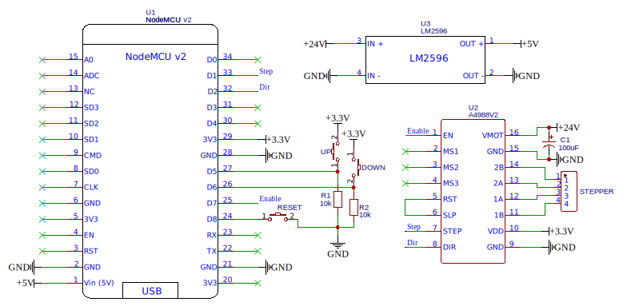

# Electrical blinds

Code for my electrical blinds project. Code is run on NodeMCU v2, for motor driver I used A4988 stepper motor driver. Blinds are controlled via MQTT protocol.
## Features 
* Control via MQTT protocol
* Control with buttons
## Installing / Getting started
If you want to use this repository and build something similar you need to use this wiring diagram:
  
After installing code on your NCU you need to flash data folder into memory with LittleFS upload tool.
You also need to get certs.ar file to data folder, otherwise it will not load program. During first start,
after a while program will run a website to put your Wi-Fi and MQTT credentials. After that they will be saved
in flash memory. Before first run you should also set max and zero positions.
I didn't put my 3D printed mounting here because these are quite made to measure to work with my blinds.
Other than that this is most things that should make the whole thing running.
## Usage 
Messages for controlling blinds:
* (set-zero) - set 0 position of the blinds.
* (set-max) - set max position of the blinds.
Blinds will move between these two positions after set.
* \<percent> - moves blinds to desired percent of max position.
* (reset) - these message will reset web configuration, and run simple web server to put new settings.
* (manual) - enable manual mode for moving with buttons, use it to define zero and max position. If manual mode is already enabled it will be disabled after receiving this.
* [ +, -] <steps> - this will move blinds by amount of steps and direction indicated by "+" or "-" sign.
* Besides web control you can control blinds with buttons. There is also reset button with works same as (reset) message.
